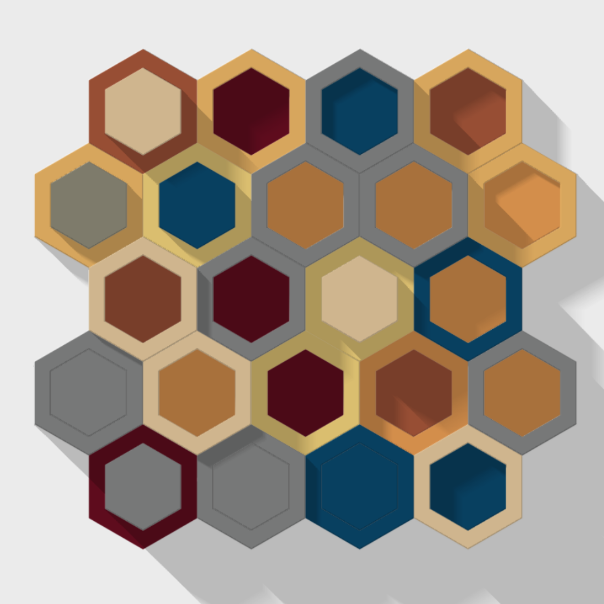

<!-- README.md is generated from README.Rmd. Please edit that file -->

# cubicles

<!-- badges: start -->
<!-- badges: end -->

I was inspired by this [beautiful
creation](https://mastodon.online/@nrennie@fosstodon.org/109389979155033662)
of [Nicola Rennie](https://mastodon.online/@nrennie@fosstodon.org) to
try something similar using packages
[{sf}](https://r-spatial.github.io/sf/) and
[{rayshader}](https://www.rayshader.com/).

The color palettes are from Blake R. Mills
[{MetBrewer}](https://github.com/BlakeRMills/MetBrewer) package, and my
own [{MexBrewer}](https://paezha.github.io/MexBrewer/) collection.

## Preliminaries

Load packages:

``` r
library(dplyr) # A Grammar of Data Manipulation
#> 
#> Attaching package: 'dplyr'
#> The following objects are masked from 'package:stats':
#> 
#>     filter, lag
#> The following objects are masked from 'package:base':
#> 
#>     intersect, setdiff, setequal, union
library(ggplot2) # Create Elegant Data Visualisations Using the Grammar of Graphics
library(glue) # Interpreted String Literals
library(imager) # Working with images
#> Loading required package: magrittr
#> 
#> Attaching package: 'imager'
#> The following object is masked from 'package:magrittr':
#> 
#>     add
#> The following objects are masked from 'package:stats':
#> 
#>     convolve, spectrum
#> The following object is masked from 'package:graphics':
#> 
#>     frame
#> The following object is masked from 'package:base':
#> 
#>     save.image
library(MetBrewer) # Color Palettes Inspired by Works at the Metropolitan Museum of Art
library(MexBrewer) # Color Palettes Inspired by Works of Mexican Muralists
#> Registered S3 method overwritten by 'MexBrewer':
#>   method        from     
#>   print.palette MetBrewer
library(rayrender) # Build and Raytrace 3D Scenes
#> Warning: package 'rayrender' was built under R version 4.2.2
#> 
#> Attaching package: 'rayrender'
#> The following object is masked from 'package:ggplot2':
#> 
#>     arrow
library(rayshader) # Create Maps and Visualize Data in 2D and 3D
#> Warning: package 'rayshader' was built under R version 4.2.2
library(sf) # Simple Features for R
#> Linking to GEOS 3.9.1, GDAL 3.4.3, PROJ 7.2.1; sf_use_s2() is TRUE
```

Randomly sample numbers for the random seeds:

``` r
seed_1 <- sample.int(1, n = 1000000)
seed_2 <- sample.int(1, n = 1000000)
```

## Create a tessellation

Define the parameters for the canvas, i.e., the coordinates of the left
bottom corner (`x_o` and `y_o`) and the size in x (`d_x`) and y (`d_y`):

``` r
set.seed(seed_1)

x_o <- 1
y_o <- 1
d_x <- sample(2:5, 1)
d_y <- d_x
```

Create a polygon for the canvas:

``` r
# Create a matrix with the coordinates of the polygon that becomes the canvas
canvas <- matrix(c(x_o, y_o, # bottom left corner
                   x_o, y_o + d_y, # top left corner
                   x_o + d_x, y_o +d_y, # top right corner 
                   x_o + d_x, y_o, # bottom right corner
                   x_o, y_o), # Return to bottom left
                 ncol = 2,
                 byrow = TRUE)
```

Convert the coordinates to polygons and then to simple features:

``` r
canvas <- data.frame(geometry = st_polygon(list(canvas)) |> 
                       st_sfc()) |> 
  st_as_sf()
```

Randomly sample a number for the random seed:

``` r
seed_1 <- sample.int(1, n = 1000000)
seed_2 <- sample.int(1, n = 1000000)
```

## Hexicles

Create a tessellation:

``` r
# Set seed
set.seed(seed_2)

hex_cubicles <- canvas |>
  st_make_grid(cellsize = 1,
               square = FALSE)

hex_cubicles <- data.frame(c = sample(1:10, 
                                      length(hex_cubicles), 
                                      replace = TRUE),
                           geometry = hex_cubicles) |>
  st_sf()
```

Buffer using a negative distance to create an inner polygon:

``` r
# Set seed
set.seed(seed_1)

hex_cubicles_2 <- hex_cubicles |>
  st_buffer(dist = -0.15) |>
  mutate(c = sample(1:10, 
                    nrow(hex_cubicles), 
                    replace = TRUE))
```

Carve the outer boxes:

``` r
hex_cubicles <- hex_cubicles |>
  mutate(geometry = st_difference(hex_cubicles$geometry,
                                  st_union(hex_cubicles_2$geometry)))
```

Bind outer and inner boxes:

``` r
hex_cubicles <- rbind(hex_cubicles |>
                        mutate(type = "outer"),
                      hex_cubicles_2 |>
                        mutate(type = "inner"))
```

Plot 2D image:

``` r
# Set seed
set.seed(seed_2)

# Select collection of color palettes
edition <- sample(c("MexBrewer", "MetBrewer"), 1)

if(edition=="MexBrewer"){
  # Randomly select a color palette (MexBrewer Edition)
  palette_name <- sample(c("Alacena", "Atentado", "Aurora", "Concha", "Frida", "Revolucion", "Ronda", "Tierra"), 1)
  # col_palette <- mex.brewer(palette_name, n = 25)
  col_palette <- mex.brewer(palette_name)
  
}else{
  # Randomly select a color palette (MetBrewer Edition)
  palette_name <- sample(c("Austria", "Cassatt1", "Cassatt2", "Cross", "Degas", "Derain", "Egypt", "Gauguin", "Greek", "Hiroshige", "Hokusai1", "Hokusai2", "Hokusai3", "Homer1", "Homer2", "Ingres", "Isfahan1", "Isfahan2", "Juarez", "Klimt", "Lakota", "Manet", "Monet", "Moreau", "Morgenstern", "Nattier", "Navajo", "NewKingdom", "Nizami", "OKeeffe1", "OKeeffe2", "Peru1", "Peru2", "Pillement", "Pissaro", "Redon", "Renoir", "Robert", "Signac", "Stevens", "Tara", "Thomas", "Tiepolo", "Troy", "Tsimshian", "VanGogh1", "VanGogh2", 'VanGogh3', "Veronese", "Wissing"), 1)
  col_palette <- met.brewer(palette_name)
}

# Create ggplot object
p <- ggplot() +
  geom_sf(data = hex_cubicles,
          aes(fill = c),
          color = NA) +
  scale_fill_gradientn(colors = col_palette) +
  theme(legend.position = "none",
        axis.text = element_text(color = "white"),
        panel.background = element_rect(fill = "white"),
        axis.ticks = element_line(color = "white"))
```

Convert the ggplot object to a 3D image using {rayshader} and save:

``` r
plot_gg(p,
        phi = 90,
        theta = 0,
        height_aes = "fill",
        raytrace = TRUE,
        windowsize = c(800, 800))

# Save image
rgl::snapshot3d(glue("outputs/hexicles-{seed_1}-{seed_2}.png"),
                fmt = 'png',
                webshot = TRUE,
                width = 2100,
                height = 2100)

# Close rgl device
rgl::rgl.close()
```


